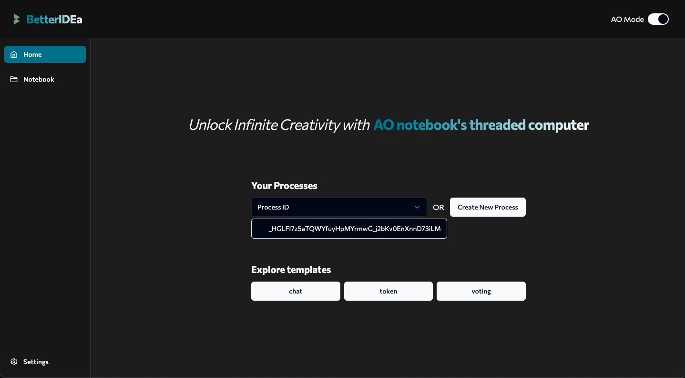
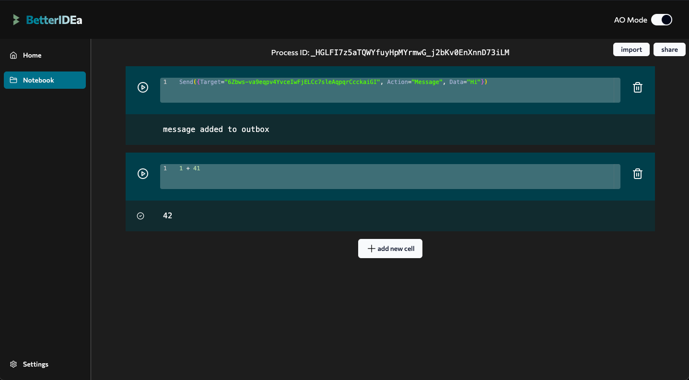
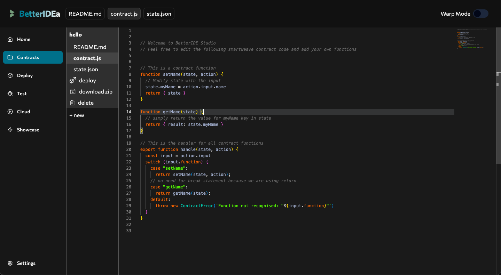

# BetterIDEa - A better IDE for Arweave smartcontracts

[](https://protocol.land/#/repository/c38d3d29-8fd8-4d40-af69-570e6feca20e)

Try it [here](https://ankushKun.github.io/betterIDE/)

<details>
<summary>View screenshots</summary>







</details>

## Features

- Code Editor and IDE Features such as syntax highlighting, code completion, etc.
- Web UI to run AO LUA code (using [aoconnect](https://www.npmjs.com/package/@permaweb/aoconnect))
- JS Contract deployment and testing (using [Arweavekit](https://www.arweavekit.com/) to deploy and interact)
- Universal Data Licensing of your code through Arweaves [UDL](https://arwiki.wiki/#/en/Universal-Data-License-How-to-use-it) implementation
- Cloud based storage and sharing through Arweave [Protocol Land](https://protocol.land)

## Tech Stack

- Vite, React, Typescript, TailwindCSS
- Monaco for React
- Arweavekit
- ArConnect
- Arlocal
- AOConnect

## Run it yourseld

### Prerequisites

- Node.js LTS & npm
- Arweave Wallet (ArConnect)

### Fork, Clone, Install and Run

```bash
git clone git@github.com:<YOUR_USERNAME>/ide.git betteridea
cd betteridea
pnpm install
pnpm run dev
```

Open [http://localhost:5173/](http://localhost:5173/) as simple as that!

## Contributing

Contributions are welcome! Please open an issue or submit a pull request.
