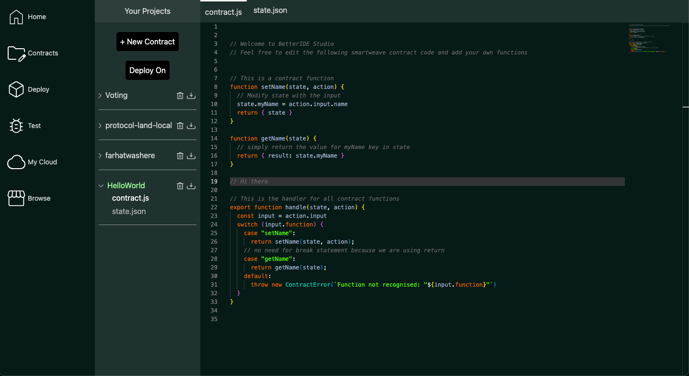
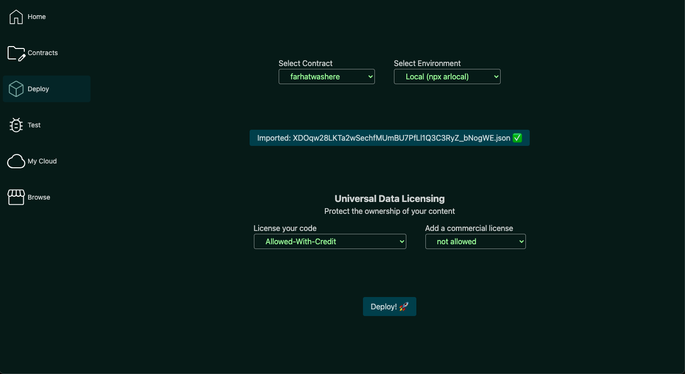
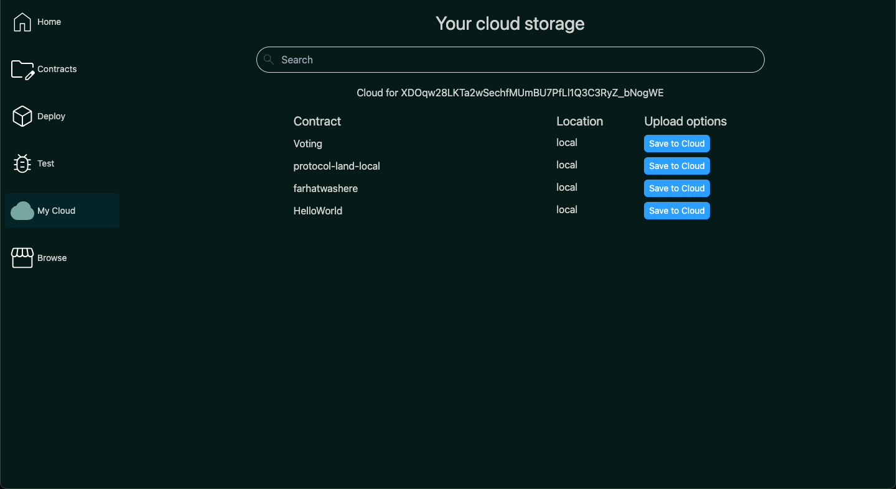

# BetterIDEa - A better IDE for Arweave smartcontracts

Try it [here](https://ankushKun.github.io/betterIDE/)

<details>
<summary>View screenshots or video</summary>

<iframe width="560" height="315" src="https://www.youtube.com/embed/R-8LvUOyQuw?si=PW5z8Crrw_GuP6xT" title="YouTube video player" frameborder="0" allow="accelerometer; autoplay; clipboard-write; encrypted-media; gyroscope; picture-in-picture; web-share" allowfullscreen></iframe>







</details>

## Features

- Code Editor and IDE Features such as syntax highlighting, code completion, etc.
- JS Contract deployment and testing (using [Arweavekit](https://www.arweavekit.com/) to deploy and interact)
- Universal Data Licensing of your code through Arweaves [UDL](https://arwiki.wiki/#/en/Universal-Data-License-How-to-use-it) implementation
- Cloud based storage and sharing through Arweave [Protocol Land](https://protocol.land)

## Tech Stack

- Vite, React, Typescript, TailwindCSS
- Monaco for React
- Arweavekit
- ArConnect
- Arlocal

## Run it yourseld

### Prerequisites

- Node.js LTS & npm
- Arweave Wallet (ArConnect)
- Knowledge of React, Typescript, TailwindCSS
- Eagerness to learn and build cool stuff 💪

### Fork, Clone, Install and Run

```bash
git clone git@github.com:<YOUR_USERNAME>/betterIDE.git
cd betterIDE
npm install
npm run dev
```

Open [http://localhost:5173/betterIDE/](http://localhost:5173/betterIDE/) as simple as that!

#### Protocol land on localnet

Protocol Land has been implemented only through the local net by using `npx arlocal` and deploying the contract code and initial state from [sonar](https://sonar.warp.cc/#/app/contract/w5ZU15Y2cLzZlu3jewauIlnzbKw-OAxbN9G5TbuuiDQ?network=mainnet#code) and deployed it to npx arlocal through the same IDE.

**NOTE:** To use protocol land on your local dev machine, be sure to deploy it and copy the contract id and replace the `plandAddress` const in the `src/pages/PersonalProjects.tsx` and `src/pages/Browse.tsx` files, or cloud storage and protocol land wont work.

The source code used for this project is available in `proto-land-test.js` file.

We are working on a production ready version of protocol land integration, so stay tuned!

## Contributing

Contributions are welcome! Please open an issue or submit a pull request.

If you want something to work on, check out the [TODO](#TODO) section.

### TODO

- [ ] UI cleanup (WIP)
- [ ] Codebase cleanup and overhaul (WIP)
- [ ] Implement Protocol Land on mainnet
- [ ] Option to add user defined files to contracts
- [ ] Developer a simple & cool landing page (like [arweavekit](arweavekit.com)) explaining BetterIDE to new users
